# Better Draw Battle

A from-scratch clone of [drawbattle.io](https://drawbattle.io): a two-team drawing game with a frantic final round.
I then took the vanilla game and implemented some great quality of life features.
The game is now 670% as fun.

## screenshots

| | |
|---|---|
| 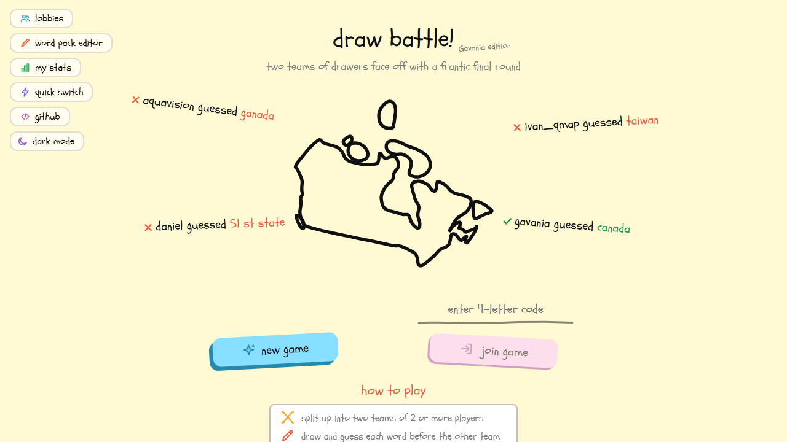 **home** | 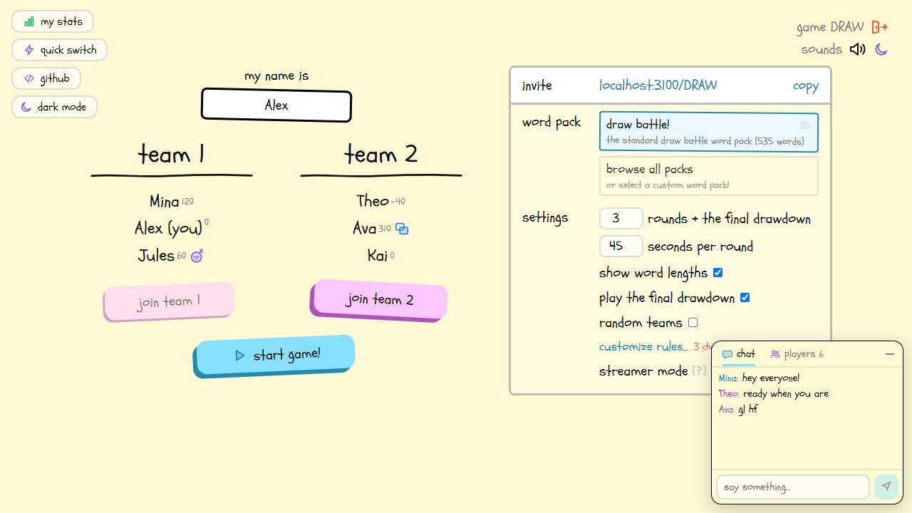 **lobby** |
| 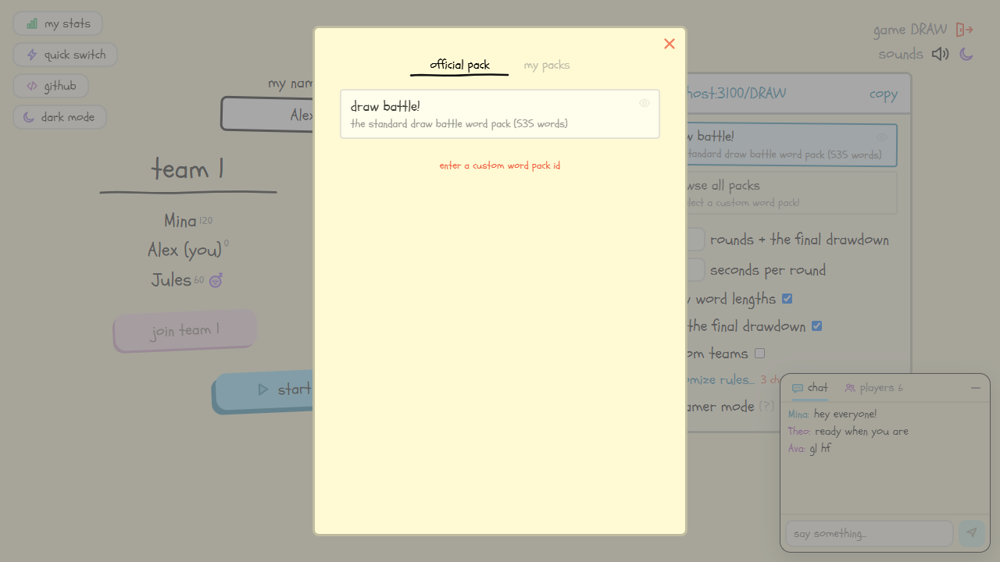 **word packs** | 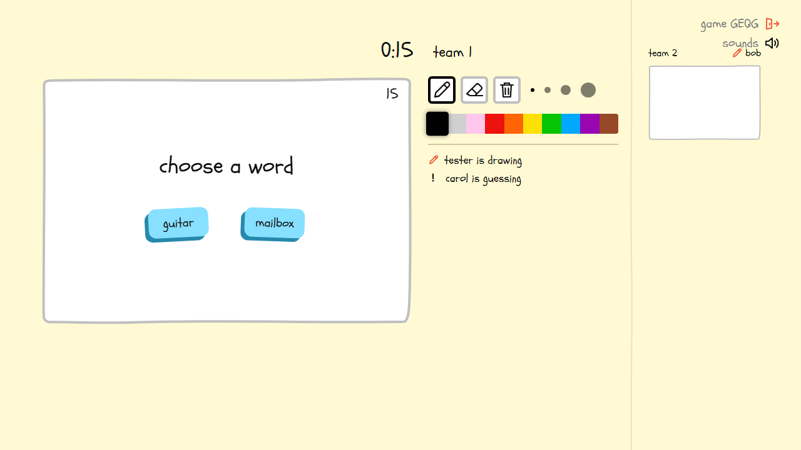 **choosing a word** |
|  **drawing & guessing** | 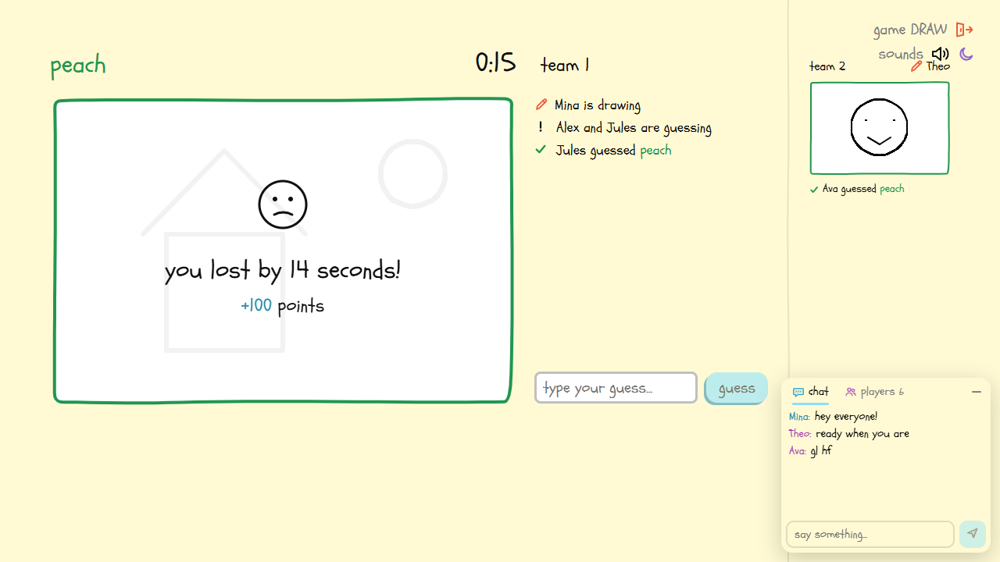 **round result** |
| 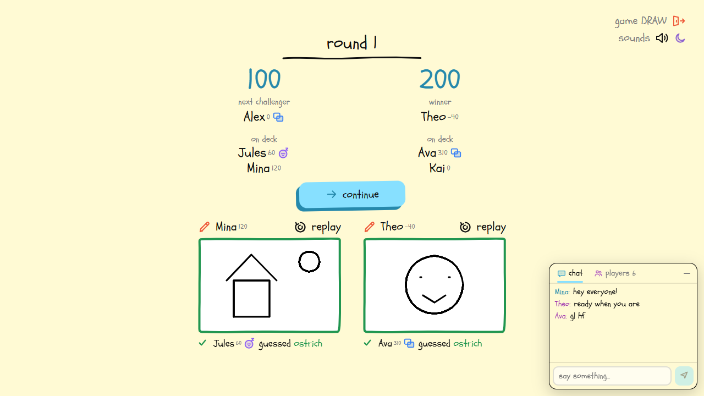 **score screen** | 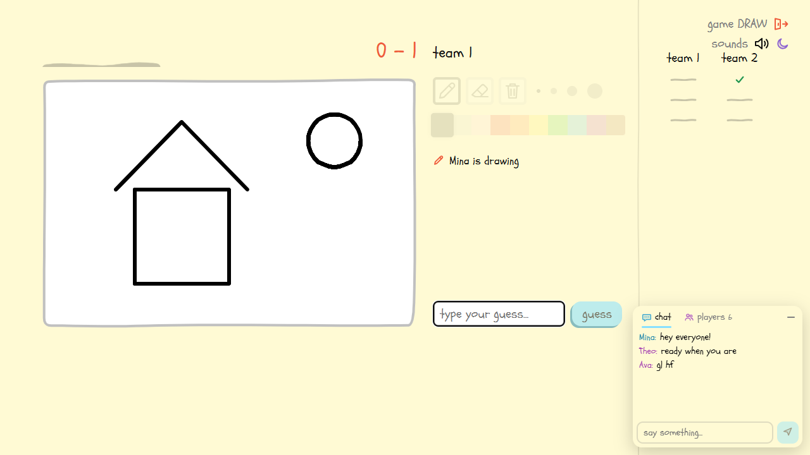 **the final drawdown** |
| 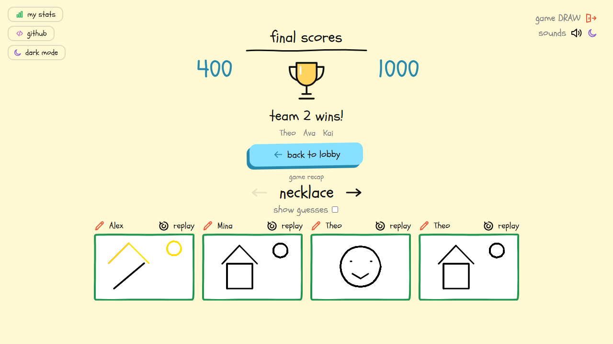 **summary & recap** | 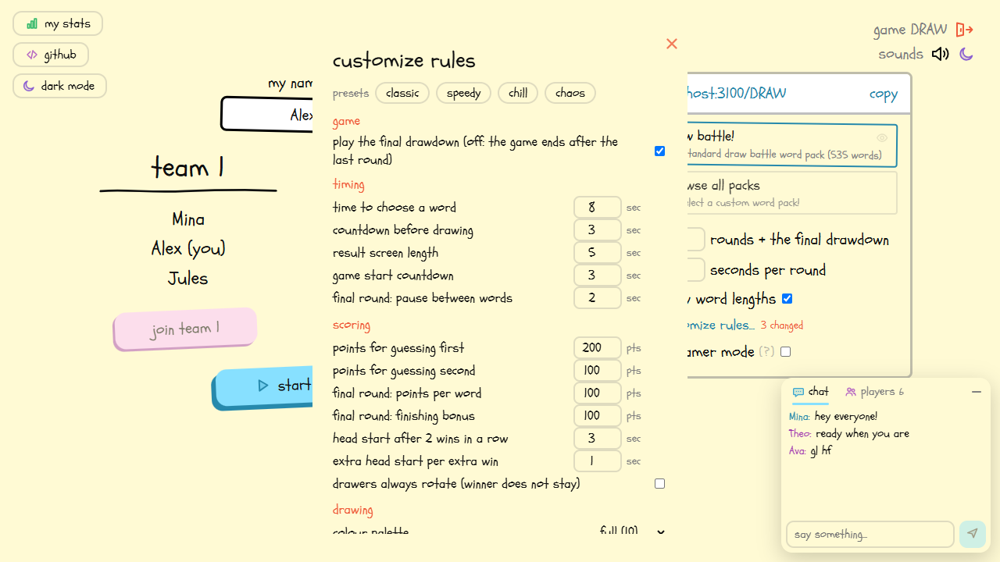 **customize rules** |
| 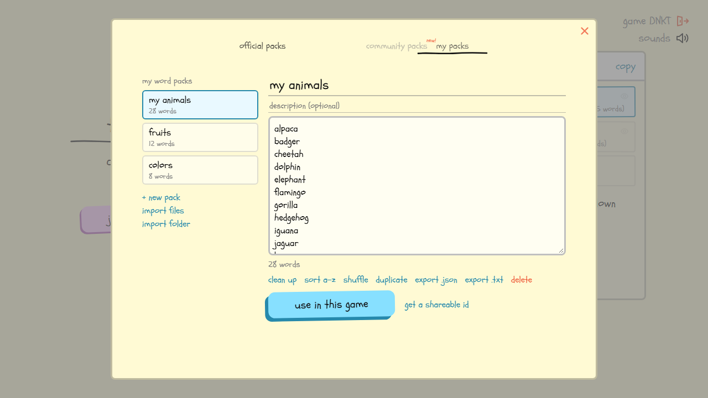 **word pack editor** | 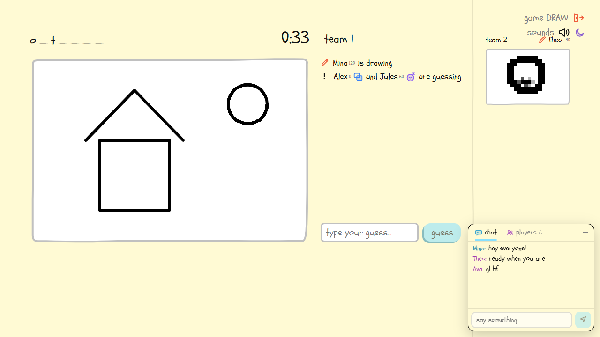 **letter hints (custom rule)** |
| 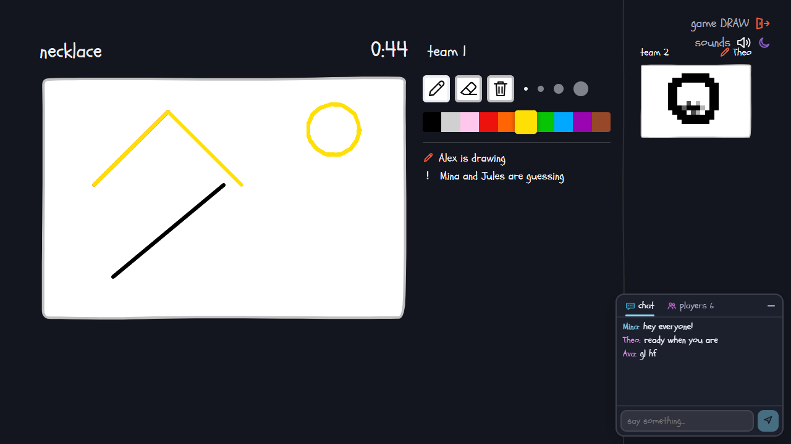 **dark mode** | 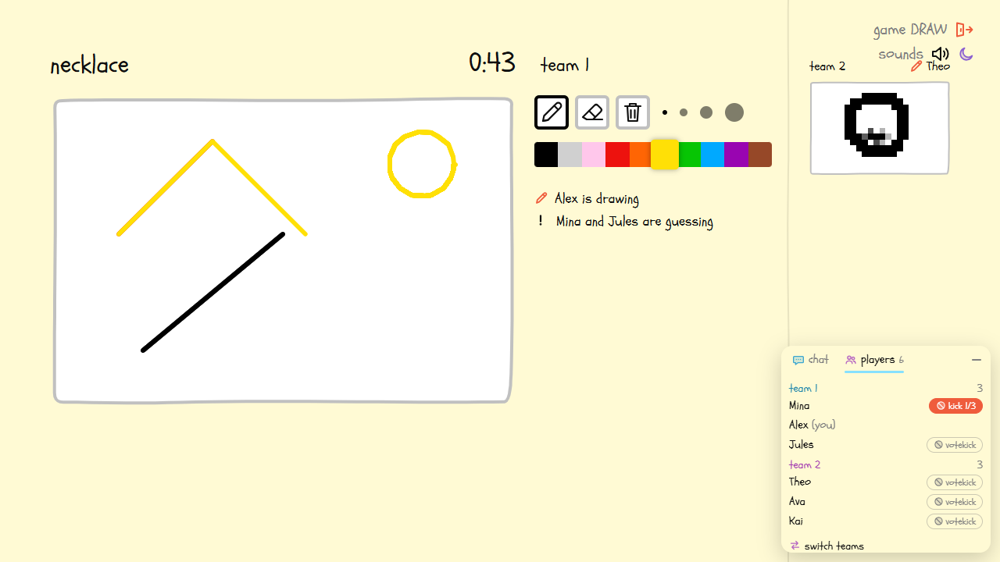 **chat, vote kick and team switch requests** |
| 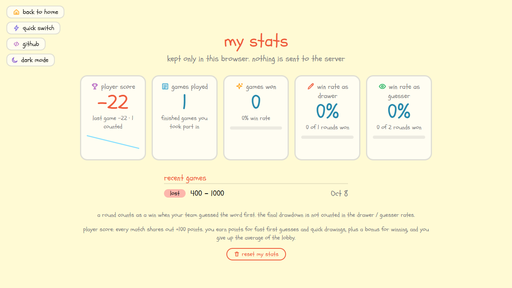 **my stats (local dashboard)** | 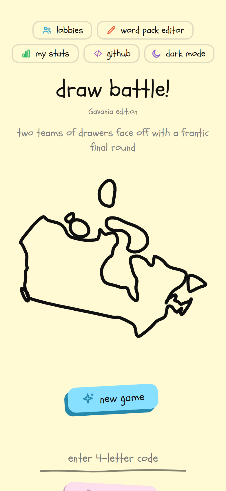 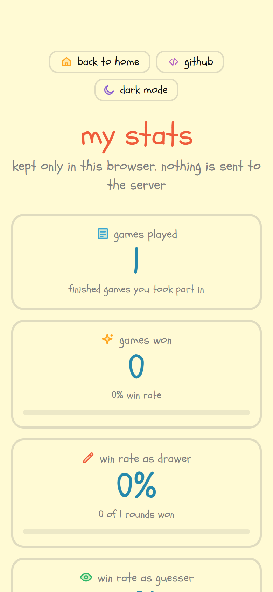 **made for phones too** |

## customization (not in the original)

Every game has a **customize rules...** dialog in the lobby (anyone in the lobby can change it; presets: classic, speedy,
chill, chaos). All rules are stored in the game's settings, so they apply to everyone and survive "back to lobby".

| group | rules |
|---|---|
| timing | time to choose a word, countdown before drawing, result screen length, game start countdown, final-round pause between words |
| scoring | points for first / second guess, final-round points per word and finishing bonus, head start base and step (or off), drawers always rotate |
| drawing | colour palette (full / basic / greys), allow eraser, allow clear |
| guessing | 2-4 words to choose from, letter hints every N seconds, forgive one typo, single-word answers only, longest word allowed |
| players | max team size, allow spectators, allow joining after the start |
| game | play the final drawdown (turn it off and the game simply ends after the last round) |

Every number rule (and the round count and round length in the lobby) takes a typed whole number, clamped to a sane range
(rounds 1-200, round length 5-600 s).

### in-game chat, vote kick and team switching

* **chat** – a compact panel at the bottom right of every game (lobby, rounds, final). Everyone, including both teams, sees it.
  Spectators can read along. Messages are rate limited, and a message that contains the word currently being drawn is
  blocked so nobody can spoil a round.
* **vote kick** – open the *players* tab and press *votekick* next to someone. A kick needs **more than half of the other
  active players** (7 players: 6 can vote, 4 votes kick). It needs at least 3 active players and never removes a team's only
  player. If the kicked player was drawing (or choosing the word) the next active teammate takes over and the canvas is
  cleared. A kicked player cannot rejoin that game.
* **forced start** – when someone forces the next round, a planned drawer who never pressed *continue* is skipped in favour
  of the next active teammate.
* **switch teams** – between rounds, a player on a team with **more than 2 active players** can ask to switch. It passes
  when more than half of the other active players agree. Requests are dropped when the next round starts.
* **usernames** – up to 16 characters; `(you)` can never be part of a name (the lobby adds its own tag to your own entry).

### my stats

The **my stats** page (`/stats`) is a dashboard that lives entirely in your browser (localStorage): games played, games won and
win rate, and your win rate as a drawer and as a guesser (rounds only; the final drawdown is not counted), plus your recent
games. Nothing is sent to the server, and you can reset it at any time.

### dark mode

Every page has a **dark mode** toggle (top left, or the corner of a game). It follows your system setting until you pick one,
and remembers your choice. The drawing canvas always stays white.

### game codes and lobbies

**new game** lets you pick your own 4-letter code (or press *random*; leaving it empty also picks a random one).
The **lobbies** page (`/lobbies`) lists every open game with its players and progress; games that haven't started and
aren't full can be joined directly, and any game that allows spectators has a **spectate** button
(`/CODE?spectate=1`). Streamer-mode games are not listed.

### word pack editor

There is one official word pack. Open the **word pack editor** on the home page (`/wordpacks`) or the **my packs** tab of the
word pack window in a lobby. **clone official pack** copies the official words into your own pack to use as a base.
Packs live in your browser (localStorage). You can create and edit packs, show 1-5 words per row (side-by-side text columns), clean up / sort / shuffle,
import single files or a **whole folder** (each `.txt`, `.csv` or `.json` file becomes a pack), and export as `.json` / `.txt`.
**use in this game** uploads the pack to the server (kept in memory for 24 h, max 3000 words) and selects it for the
lobby; **get a shareable id** gives a 6-digit id anyone can enter under *browse all packs → enter a custom word pack id*.

## run

```bash
npm install
npm run build     # builds the client into dist/
npm start         # http://localhost:3000   (PORT env var to change)
```

Everything is served by one Node process: the client, the REST API under `/api` and the game socket at `/ws/`.

## how a game works

* **lobby** – players join with a name and are placed on the smaller team (max 8 per team). Anyone can switch team, rename,
  change the settings (rounds, seconds per round, word pack, show word lengths, streamer mode) and press *start game!*
  once both teams have 2+ players. A 5 second countdown (cancellable) starts round 0.
* **a round** – one drawer per team; the *chooser* picks one of two words (15s, otherwise the first is used), then a 3s
  countdown, then both teams draw/guess the same word. The first team to guess wins the round (200 pts, the other team
  gets 100 if it also guesses). The round ends when both guessed or the time runs out, followed by a 5s end screen and
  the score screen. Everyone presses *continue* (or someone forces the next round after 11s).
* **drawers** – the winner stays as drawer; the loser's team rotates. The loser's drawer chooses the next word. A drawer
  who wins 2+ rounds in a row gives the challenger a head start of `3 + (streak-2)` seconds.
* **the final drawdown** – after the last round both teams replay all round words in random order, taking turns drawing.
  Each correct guess is worth 100 points; the first team through all words gets +100 and ends the game.

## layout

```
server/index.js        REST + websocket entry point
server/game.js         game engine (lobby, rounds, scoring rules, final round)
server/wordpacks.js    word packs (+ txt files)
src/                   Vue client (views, components, shared rules in shared.js)
scripts/               asset generators (icons, sounds)
```

## notes / deliberate differences from the original

* Icons, hero art and sounds are original artwork generated for this clone (see `scripts/`).
* Word packs contain original word lists; pack ids, names and descriptions mirror the official packs, but the number of
  words differs (the clone ships a few hundred words in the standard pack).
* Analytics/error reporting of the original is not included.
* Lobby / in-game disconnects are broadcast to the other clients (`UserLobbyDisconnect` / `UserDisconnect`); the original
  server silently drops lobby users and never announces disconnects.
* Only the current drawer may send canvas operations (the original server accepts them from any team member).

## deploy to railway

1. Push this folder to a GitHub repo.
2. On Railway: **New Project → Deploy from GitHub repo** and pick it. `railway.json` + `Dockerfile` are picked up
   automatically; no variables are required (Railway provides `PORT`).
3. In the service's **Settings → Networking** click **Generate Domain** and share the link.

Footprint: ~55 MB RAM idle (node heap capped at 160 MB), no timers beyond a 30 second cleanup / heartbeat tick, so an idle
server uses ~0 CPU. Optional env vars: `MAX_GAMES` (default 300), `MAX_SOCKETS` (default 1500). Games are kept in memory only. Dead games are reaped
automatically: any game with no activity for 10 minutes, a lobby nobody is connected to after 2 minutes, and a started game
whose players all dropped after 10 minutes. Every socket is pinged every 30 s, so a device that vanished (battery died, no
signal) is dropped within a minute. Tip: in Settings you can also set a memory limit (e.g. 256 MB) and enable
**Serverless** (app sleeping) if you want it to cost nothing while nobody plays — clients simply reconnect on wake.
